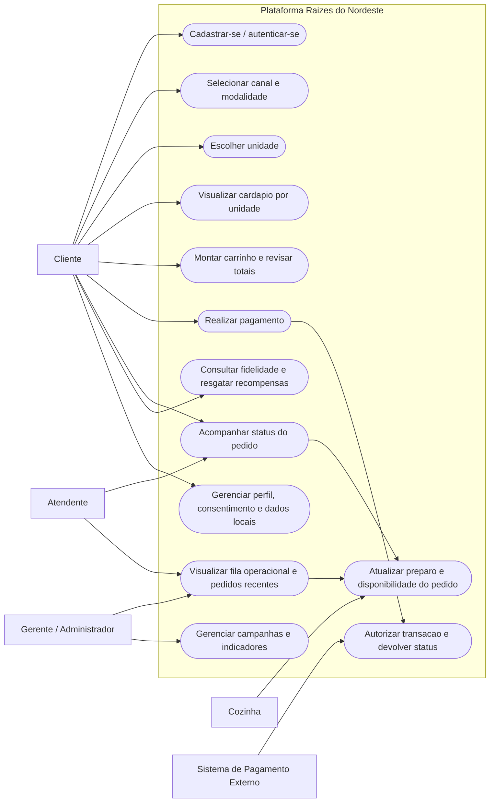

# Diagramas da Atividade

Este material consolida a secao `DIAGRAMAS (OBRIGATORIO)` do roteiro e foi alinhado com os fluxos implementados no projeto `Raizes do Nordeste`.

Observacao de aderencia:
- `Cliente`, `Gerente / Administrador` e `Sistemas de Pagamento Externos` aparecem de forma explicita no prototipo.
- `Atendente` e `Cozinha` foram modelados como atores operacionais conceituais, porque o sistema mostra fila, status do pedido e acompanhamento da producao, mesmo sem telas exclusivas para esses perfis.

## 1. Diagrama de Casos de Uso

## 2. Descricao da Feature Escolhida

### UC-FE01 - Realizar pagamento com integracao externa simulada

**Descricao**  
O cliente revisa os itens do carrinho, informa seus dados minimos, escolhe a forma de pagamento e envia a cobranca para um parceiro externo simulado. A interface retorna com confirmacao visual, cria o pedido, registra o consentimento do checkout e libera o acompanhamento do status.

**Ator principal**  
Cliente

**Demais atores**  
Sistema de Pagamento Externo, Atendente, Cozinha

**Pre-condicoes**
- O cliente ja iniciou sessao ou entrou como visitante.
- Uma unidade foi selecionada.
- Ha pelo menos um item valido no carrinho.
- O sistema ja calculou subtotal, desconto de campanha, frete e total.

**Pos-condicoes**
- O pedido e criado com identificador proprio.
- O retorno do gateway e exibido como pagamento aprovado no fluxo simulado.
- O carrinho e limpo.
- Os pontos de fidelidade sao creditados.
- O consentimento do checkout fica salvo localmente.

**Origem das informacoes**
- Dados do formulario de pagamento.
- Sessao atual do cliente ou visitante.
- Carrinho atual e campanhas aplicaveis.
- Parametros da unidade escolhida.

**Fluxo principal**
1. O cliente acessa a tela de pagamento a partir do carrinho.
2. O sistema carrega o resumo da compra, a unidade, o canal e a modalidade.
3. O sistema preenche nome, e-mail e telefone com base na sessao atual.
4. O cliente escolhe a forma de pagamento.
5. O sistema mostra a previsao de envio para o gateway externo `AsaPay`.
6. O cliente confirma os consentimentos obrigatorios do checkout.
7. O cliente aciona `Confirmar pagamento`.
8. O sistema valida se o carrinho continua consistente.
9. O sistema envia o fluxo para a integracao externa simulada e aguarda retorno.
10. O sistema registra o pedido com status iniciais, atualiza fidelidade, grava consentimento e redireciona para o acompanhamento.

**Fluxos alternativos**
1. Se o carrinho estiver vazio ou inconsistente, o sistema bloqueia o checkout e retorna o cliente para a revisao do carrinho.
2. Se algum campo obrigatorio estiver invalido, o formulario nao e enviado.
3. Se ocorrer falha na simulacao do pagamento, a interface informa o erro e permite nova tentativa.

**Regras de negocio**
- O pagamento e representado como integracao externa, mas sem cobranca real.
- O valor total considera campanha aplicavel e frete apenas quando a modalidade e `delivery`.
- Os dados enviados ao checkout sao os minimos necessarios para autenticacao do pagamento e retorno do status.
- A confirmacao do pedido so acontece depois da validacao final do carrinho.

## 3. Diagrama da Jornada do Usuario

```mermaid
flowchart LR
    A[Primeiro contato na home] --> B{Possui conta?}

    B -- Nao --> C[Realiza cadastro e aceita LGPD]
    B -- Sim --> D[Faz login]
    B -- Visitante --> E[Entra como visitante]

    C --> F[Seleciona canal e modalidade]
    D --> F
    E --> F

    F --> G[Escolhe unidade]
    G --> H[Visualiza cardapio e campanhas]
    H --> I[Adiciona itens ao carrinho]
    I --> J{Deseja revisar ou continuar comprando?}
    J -- Continuar comprando --> H
    J -- Revisar pedido --> K[Confere subtotal, desconto, frete e pontos]

    K --> L[Preenche dados do checkout]
    L --> M[Escolhe metodo e confirma consentimentos]
    M --> N[Envio para gateway externo simulado]
    N --> O{Pagamento aprovado?}

    O -- Nao --> P[Exibe falha e retorna ao checkout]
    P --> L

    O -- Sim --> Q[Pedido confirmado]
    Q --> R[Fila da unidade / atendimento]
    R --> S[Pagamento aprovado no sistema]
    S --> T[Cozinha inicia preparo]
    T --> U[Pedido pronto para retirada ou expedicao]
    U --> V{Modalidade escolhida}

    V -- Retirada --> W[Cliente retira no balcao]
    V -- Consumo local --> X[Cliente recebe pedido na unidade]
    V -- Delivery --> Y[Pedido segue para entrega]

    W --> Z[Pontos creditados e historico atualizado]
    X --> Z
    Y --> Z
```

## 4. Como usar no PDF final

- Se voce for entregar o PDF a partir do repositorio, pode copiar este conteudo como base textual da secao de diagramas.
- Se quiser exportar os diagramas como imagem, basta colar cada bloco `mermaid` em um renderizador compativel e gerar `PNG` ou `SVG`.
